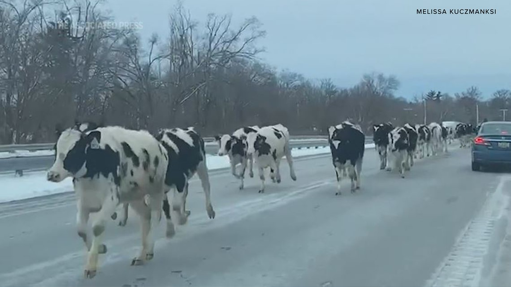

...it's me. I'm the April Fool.  I was born on April 1st, and in all my years of turning one year older, I have never been significantly pranked.  "What??" you may say.  "How can that be??" Simply put, I think pranks are more difficult and risky than people are willing to deal with.  You don't know whether it will go over well, and it takes time and preparation to pull one off--and since it's my birthday, nobody wants to be upsetting, and they're also already likely efforted-out by having to get me a present and/or attend some kind of gathering.  I think the most drastic "prank" I've encountered for April Fools' day is the time my dad told me that he was going to be late coming home, since someone's fence had broken and I-40 was now overrun with cattle.  Not entirely unbelievable, since that's happened before to a highway in Indiana:

Nonetheless, all this prankless-birthday business has gotten me thinking about what constitutes a good prank.  Obviously, you don't have to be as over-the-top about it as [some Youtubers](https://www.youtube.com/watch?v=CAQty_peKVw) are. Good pranks range from hiding two things, but telling them you hid three, to wrapping all their furniture in tin foil while they're out of the room.  Check out [this list](https://mashable.com/article/easy-pranks/) and [this one](https://www.romper.com/p/13-easy-april-fools-day-pranks-to-play-because-some-people-are-lazy-46545) for some other inspired pranking ideas. Overall, it seems a good prank involves: 

1. Surprise
2. Mild Inconvenience
3. Creativity
4. A general Spirit of Good Intent

Mix those things together, and you'll be pranking like a pro in no time!  Maybe next year, I'll create an elaborate prank to play on all my friends... or maybe, I'll pull the ultimate lazy prank and just tell them that I set something huge up... and then watch as they peek around corners all day B-)