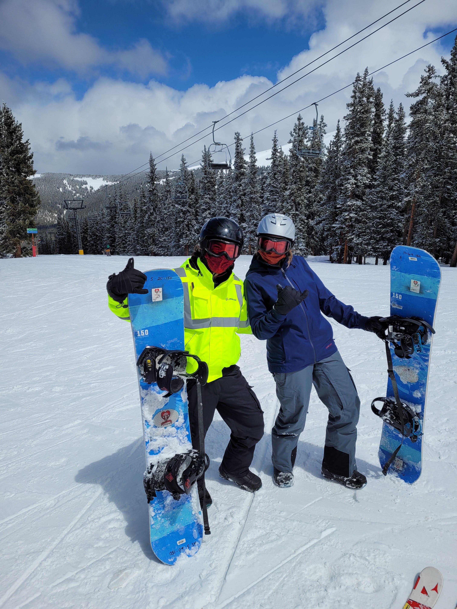

This week, I am visiting my brother in Colorado (fully vaccinated, don't worry!).  He goes to school in Boulder and even though it's April, the weather still seems to think it's winter here.  So, this past weekend, we went snowboarding.  

It was hype.  I learned to ride on my heels, toes, and even to turn.  The snowboard instructors called us "naturals." That said, I also fell A LOT.  I faceplanted.  I elbows-and-knees-planted.  I'm pretty sure my tailbone got bruised.  So if we were doing better than the average snowboarding noob, I couldn't help but wonder... how many times a day does this instructor guy watch people bite it? And then, how many times a day does he watch people get back up again, and keep trying? It's probably a pretty funny sight... but maybe, also an inspiring one.  I know I looked a little silly covered in the fresh, powdery snow... but I also felt good about getting up, and trying again, over and over.  

[Perseverance](https://www.merriam-webster.com/dictionary/perseverance#:~:text=%3A%20continued%20effort%20to%20do%20or,an%20instance%20of%20persevering%20%3A%20steadfastness) is a funny thing.  When it comes to the amount of time people will spend on a website looking for information they need, the time-before-giving-up is only seconds long.  But for bigger goals, people are more willing to fail time after time, and just see it as setbacks on thier way to their ultimate achievement.  Among all of the [methods touted as the key to achieving your goals](https://blog.iqmatrix.com/overcome-failure), re-evaluating and starting again after a setback is crucial.  After all, no one sails smoothly to the top.  We all suffer a few bumps and bruises along the way.  The key is to get up, and try again.  