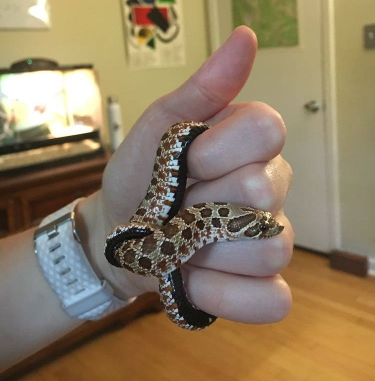

This past summer, it happened to me, too.  An idea I saw online took root in my mind and I did things in actual, real life because of it.  In other words, I got Influenced.  Perhaps, in 2020, the idea of taking advice or making purchases based off of suggestions from strangers online had become commonplace.  But never before have I made this big of a life choice based off of cool content I saw online.  It happened while I was staying at home like everyone else, bored in my free time, armed with what I'd saved for trips I couldn't take and concerts I couldn't go to.  In summer 2020.... I got a pet.    

It happened like this. One day, after work, I was passing time on my recently-downloaded lastest distraction, [TikTok](tiktok.com), when I came across a video of the cutest thing I had ever seen. Click the image to watch!

Now, keep in mind that I'm not hugely into reptiles.  But that video, and that little snake, are undeniably adorable.  That short clip tickled the "Wow, that's CUTE" part of my brain, and I got to researchin'.  I had wanted a small pet for a while, but hadn't yet found the right kind.  I saw drawbacks with every small animal: hamsters make a lot of noise at night and don't smell great, guinea pigs need guinea pig companions to avoid loneliness, fish are fine but you can't pick them up, turtles require too much space, hedgehogs have very specific needs... it goes on.  But little [hognose snakes](https://en.wikipedia.org/wiki/Western_hognose_snake)? I couldn't find anything wrong with them.  They're the perfect pet! They are small and cute, you can hold them, they don't smell, they eat infrequently, and they even like to be left alone for 48 hours after eating, so there's no guilt if you aren't around for a weekend trip.  Also, to be clear, unless you smell like a tiny toad or mouse, they're harmless (so just, y'know, wash your hands before handling).  Works for me.  I was sold. 

Now, I know I'm not alone in picking up a quarantine companion.  But I do feel like the way I came across the idea of getting my pet was a uniquely 2020 circumstance.  All logic about pet qualities aside, I kept thinking about how I came across this idea on TikTok.  TikTok! Was I really going to take own stewardship of a small animal because of a cute video I saw online??

The answer was yes.  Yes, I was.  

Honestly, I have no regrets.  True, nothing is as shiny or perfect as it looks online--Stevie (I named him Stevie) spends a fair amount of his time out of sight, buried in the aspen shavings in his enclosure.  But everything else still holds.  He's easy to take care of, fun to hold, and darn tootin' cute.

What quarantine content have you been influenced by? Would you ever get a pet snake? Once I set up a comment section, you should leave a comment below!

Thanks for reading!
With love, 
Jules
 