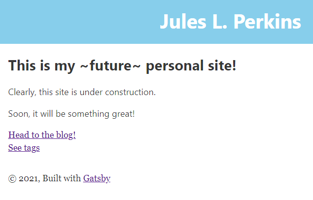

 I know what this looks like right now, but I'm asking you to trust the process.  One day, this blog will resemble those pre-formatted, beautiful blogs seen on sites like [Wix](wix.com), [Squarespace](squarespace.com), and even [Tumblr](tumblr.com).  If you're reading this in the distant future (or ideally, only a few weeks from now), you may be wondering what I'm getting on about, since this blog looks perfect! Chic! Well-formatted and accessible on web and mobile!  I'll explain.  At the time that I am writing this, the home page of this site looks like this: 

 

 Mismatched fonts and lack of images aside, it's not a very fleshed-out site.  I have visions of responsive graphics that move as you scroll and a coherent and pleasing color palette.  But for now, I'm working through the more mundane tasks of adding things like a menu and buttons to get back to the main page from subpages.  Though I've worked on web apps before, I've never created a site from the ground up, so I've been relying on documentation from the framework I'm using ([Gatsby](gatsbyjs.com)) and some very helpful tutorials (like [this one](https://dennytek.com/blog/personal-site-with-gatsby-part-1#table-of-contents)).  Reading through example code and working through how everything connects takes time.  And while I may not have much on this site aside from the blog yet, I've acquired a domain name--which means I figured out how to get code I write in my [IDE](https://en.wikipedia.org/wiki/Integrated_development_environment) (for non-technical readers, that's where I type the code I write) to actually generate content that's available on the real, public internet! ...and, I've set up Google Analytics, because data is fun.  

 You can think of the progression of this website as a [glow-up](https://www.urbandictionary.com/define.php?term=Glow%20Up).  We've all seen the pictures online of people who compare their current appearance to how they used to look.  Usually, they sport better fashion, a fitter bod, and more confidence in the recent pictures--but what we don't see is the work that went into the transformation, or the gradual nature of the change.  My guess is that the main benefit of the glow-up isn't the "after" picture, but the habits formed and effort given and willpower flexed in the process of working on yourself.  Similarly, while I'm looking forward to the flashy, polished final version of this site, I think I'm going to more out of the process of learning how to build all this. 

 You may be wondering, why go to all this trouble? Why not just use Wix? Mostly, as a computer science major I feel that I have something to prove. Plus, I think it will be fun.  Until we get there, trust that there is work going on behind the curtain.  I'll keep you apprised of my progress. 

 Until next time, 
 Jules