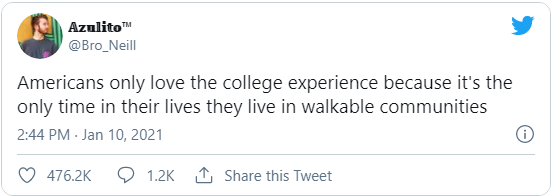

Last week, I came across this tweet: 

<!-- <blockquote class="twitter-tweet">
Americans only love the college experience because it&#39;s the only time in their lives they live in walkable communities
&mdash; 𝔸𝕫𝕦𝕝𝕚𝕥𝕠™ (@Bro_Neill) <a href="https://twitter.com/Bro_Neill/status/1348355127216910336?ref_src=twsrc%5Etfw">January 10, 2021</a></blockquote> -->

According to the American Dream, college is the only time in life when you ought to live in a truly walkable community.  The script of the quintessential upper-middle-class American life story goes something like this: 

1. Be born and raised in the suburbs to a nuclear family.  One parent drives to work every day, and another is a stay-at-home parent who drives you to school and sports practice every day.  This happens until...
2. You turn 16 and get your license! Unbridled freedom is upon you, as you can now drive yourself to all the places you need to go. Then, after graduating high school...
3. You head to college! You live on campus or just nearby, and everything you need (friends! food! school! night life!) is within a mile or two of where you live. Eventually, you graduate, and...
4. You get a job! You move away from home, get your own apartment, and take yourself to work every day.  You make some money until maybe you meet someone special, and then...
5. Completing the cycle, you and your special someone buy a house in the 'burbs, have 2.5 kids, and drive to work or school or the grocery store for 40-odd years until you retire.  

Maybe, in your young-adult years, you live in a city for a while. Maybe, once you retire, you move in to an old folks' home with bus shuttles that take you to various outings.  But if you follow this well-trodden path, there's a lot of years where daily driving just to get to everything you need is involved.  According to [this article from Fatherly](https://www.fatherly.com/gear/how-much-time-do-american-families-spend-in-their-cars/#:~:text=Americans%20spend%20a%20whopping%2084,trillion%20miles%20to%20the%20odometer.), on average, Americans spend 6% of their waking hours driving a car.  That comes out to about an hour per day.  All of that time adds up, in tolls on physical health as well as environmental impact. This may partly be because viable alternatives in the US are few and far between.  In only seven metro areas in the entire country do more than 10% of commuters take public transit to work (stat from [this Bloomberg article](https://www.bloomberg.com/news/articles/2019-01-22/how-americans-commute-to-work-in-maps#:~:text=Walk%20to%20work%3A%20Less%20than,and%20Boston%20(5.2%20percent).)).  Rates are especially high in New York City, which makes sense.  When people live in closer proximity to one another and metros, bus lines, and railways are readily available, more people opt out of driving themselves to work.  Rates in Europe of using non-driving methods of transport for a commute are [even higher](https://www.bloomberg.com/news/articles/2017-10-18/the-many-ways-europe-s-city-dwellers-get-to-work).  The car is woven into the common understanding of what it means to be an American, but it doesn't have to--and maybe it shouldn't--be that way. 

I grew up in a suburb of a university town, with sidewalks, restaurants, and businesses lining the downtown area near campus.  My dad has had a 45-minute commute for most of my life.  I've also spent time living in a small German town where the entire main street was one enormous, beautiful, stone-paved pedestrian zone.  I've seen how much community and a sense of place is fostered by people running into one another, having places to spend time with each other, and feeling welcome in familiar streets.  Suburbia has its benefits--outdoor space, comfortable homes--but in the absence of a walkable, bustling city center of sorts, individual homes can't create the same sense of place or sensical lifestyle.  Picking up groceries on your way home from work sounds a lot less draining when it's all part of a 30-minute stroll outside instead of a 30-minute fight against traffic.  I don't know what the answer is to America's infrastructure issues, but recognizing the value of a walkable community seems like a great place to start.  