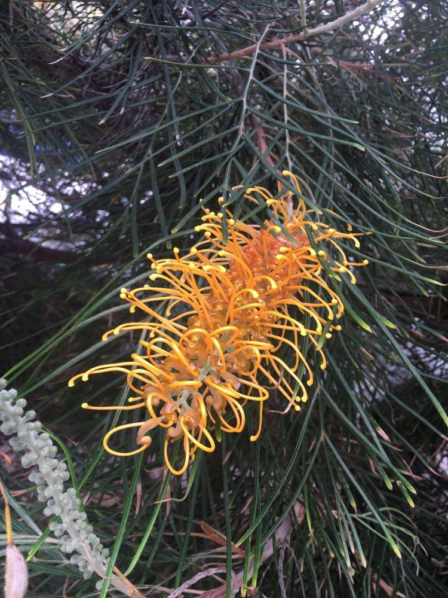
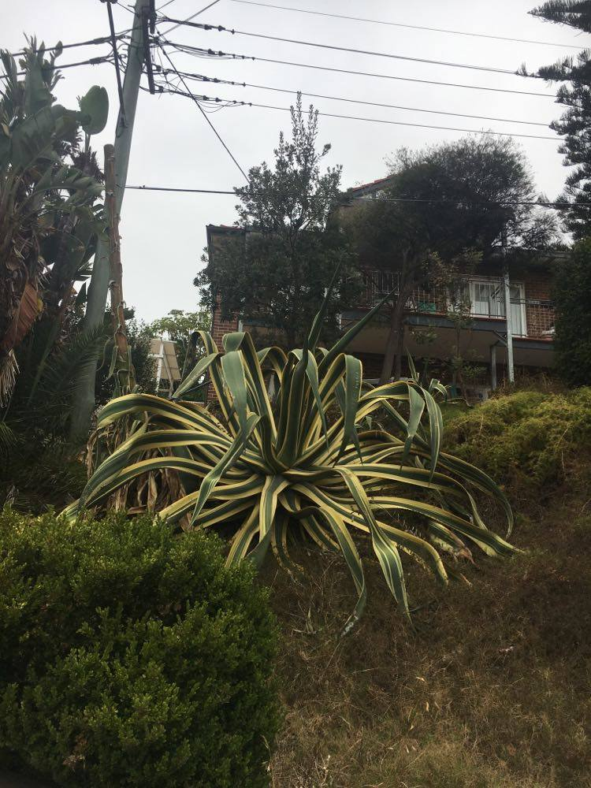
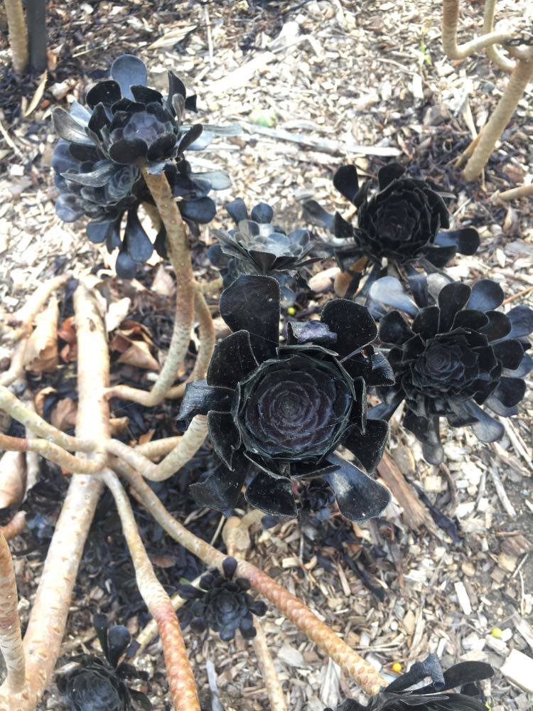
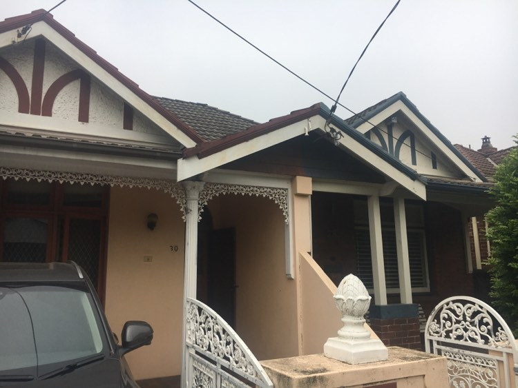
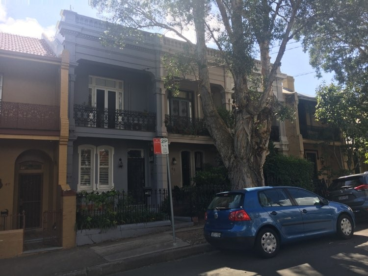

Last spring, I had the good fortune to spend a semester "down under," living in Sydney, Australia.  When I first arrived, all I could see were the similarities.  Sure, people had accents, but beyond that, the similarities of our two British-colony-turned-independent-nations abounded.  The social norms, architecture, and ways of going about life were pretty similar to what I've lived with in the USA, so you can imagine my surprise when one day, about a week after arriving, I was walking home from the bus stop though a park and I noticed THIS THING: 

I thought I was looking at a dinosaur.  The pitch-black, segmented, spindly legs and disproportionately long bill were like no other bird I'd seen before.  For some reason, this bird took me completely by surprise.  And once I noticed that oddity, differences started cropping up everywhere.  Plants were most notably different--here are a few pictures to prove it: 

It started off with the crazy flora and fauna and quickly progressed to everything from houses to hairstyles. One of my favorite details of difference was the wrought-iron trim on so many of the smaller houses in Sydney. 

As I took note of the unexpected, the fact that I was, indeed, very far from home became as wondrous and exciting as the new discoveries I was making.  It was a good lesson in keeping an open mind.  When you make assumptions about a situation that feels vaguely familiar, you miss out on the chance to appreciate the differences and experience the freshness of something entirely new.  

What's funny is that these White Ibises are considered trash birds in Sydney, kind of like pigeons in New York. They're even nicknamed "bin chickens" because of their propensity to dig through the garbage bins.  They're viewed as a nuisance--a far cry from the strange and beautiful wonder that I had taken them for.  So while I won't go singing the praises of the white ibis to any Australians (unless I want them to look at me like I have two heads), I will always have a special fondness for these odd relics of strange evolution. 

That's all for now, 
Jules