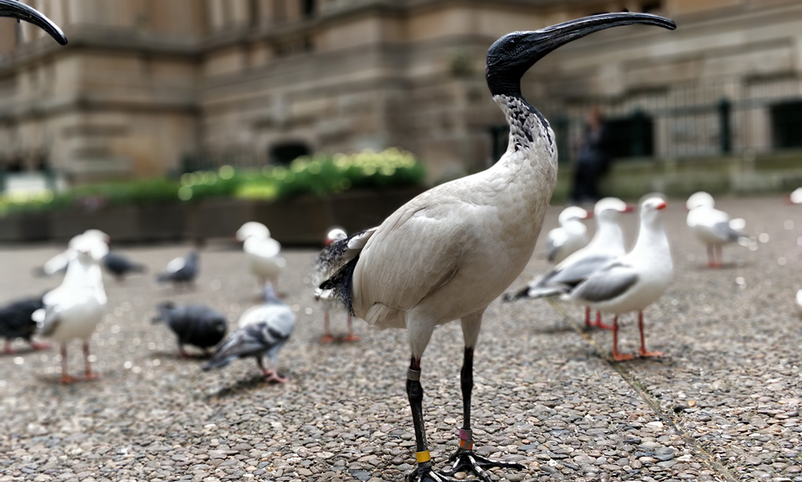

Last spring, I had the good fortune to spend a semester "down under," living in Sydney, Australia.  When I first arrived, all I could see were the similarities.  Sure, people had accents, but beyond that, the British-colony-turned-independent-nation influences that created a similar culture abounded.  The social norms, architecture, and ways of going about life were pretty similar to what I've lived with in the USA, so you can imagine my surprise when one day, about a week after arriving, I was walking home from the bus stop though a park and I noticed THIS THING: 

I thought I was looking at a dinosaur.  The segmented, spindly legs and disproportionately long bill .....

...to be continued :)

-ugly bird

-started to notice crazy flora and fauna

-the fact that I was, indeed, very far from home became as wondrous and exciting

-reminder to keep an open mind? not make assumptions that you know what's up in a new situation, even if in some ways it feels familiar?

-what's funny is that these beautiful relics of weird evolution are trash birds in Sydney, kind of like pigeons in new york. Not considered wondrous.  To me, they were special.

Yayy