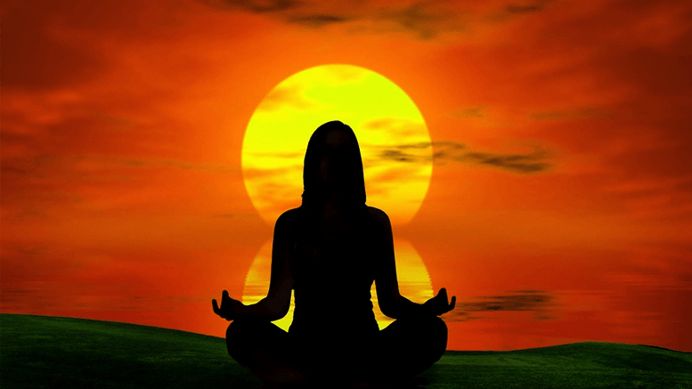

Breathe in.... breathe out.  Take a moment to stop, right now, and notice the cadence of your breath.  It's rhymthic. Cyclical. Unending and everpresent.  Whenever you feel stress coming on, simply return to your breath to restore calm.  I, for one, float upon the ebb and flow of my breath to remain centered and maintain a calm state of serenity in everything I do. 

...well, not quite.  Lol, how annoyingly pious did you think this blog was going to be?  In reality, I do yoga every once in a while, and while I do spend my whole life breathing, I spend significantly less of my time in a state of breath-induced bliss.  

I do like yoga.  I like how it bends my body, and the challenge of holding difficult poses, and the combination of balance and power that are involved in doing so.  I like the mindfulness aspect that comes along with carving out time in your day to do nothing but clear your mind and be in your body.  Everything from the fact that yoga is an [ancient tradition](https://artsandculture.google.com/story/explore-the-ancient-roots-of-yoga/rAKCRDl92CPuJg), to the aesthetics of the Americanized version of yoga, appeal to me.  I even consider myself to be the "kind of person" who does yoga.  When you look at how infrequently I actually roll out a yoga mat, though, that's quickly revealed as wishful thinking.  If yoga is so great, why am I not doing this every day? 

I think it has something to do with how there is no concrete "outcome" from a session of yoga.  I've been raised to recognize value in good grades, games won, and "next levels" achieved.  In yoga, there's no upward trajectory to strive after--just a state of mind to spend time practicing.  My whole life, I've been training to prioritize achievement over well-being.  This week, I've set aside time to make sure I study for midterms and prepare for my part-time job (a.k.a. working towards a grade or a paycheck), but haven't carved out time for centering myself and being present.  What kind of a life is that?  I'd like to be more than the bogged-down drone described in David Foster Wallace's commencement speech [This is Water](https://fs.blog/2012/04/david-foster-wallace-this-is-water/). 

The takeaway from this reflection: the yogis have it right.  I don't want to be stuck in the individualistic, capitalist, work-centric American attitude that distracts us from focusing on some of the most important things in life: health, spiritual wellbeing, and the interconnectedness of life.  I don't know about you, but in this last semester of college, I'll be making a valiant effort to recall what's important and return to the breath.  